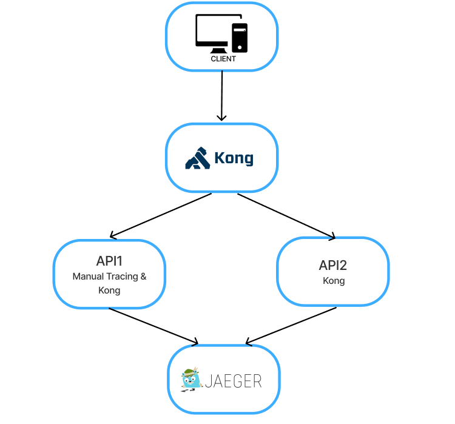

# Kong Tracing Project

## Overview
This project demonstrates the integration of **manual tracing** and **API gateway tracing** using **OpenTelemetry**, **Flask APIs**, **Kong**, and **Jaeger**. It is designed to visualize service interactions and internal operations of APIs in real-time.

The system consists of two APIs:
- **API1**: Implements **manual tracing** with realistic spans for order processing.
- **API2**: Standard API without manual tracing, traced only via Kong gateway.

All traffic is routed through **Kong**, which captures distributed traces and sends them to **Jaeger** for visualization.

---

## Architecture



- **Kong Gateway**: Routes requests to APIs and captures traces.
- **API1**: Contains multiple **manual spans** for:
  1. `manual_order_process` (main span)
  2. `check_inventory` (child span)
  3. `calculate_tax` (child span)
  4. `generate_invoice` (child span)
- **API2**: Traced automatically only via Kong gateway.
- **Jaeger**: Visualizes traces for both manual and automatic instrumentation.

---

## Installation

1. Clone the repository:

```bash
git clone <your-repo-url>
cd Kong-Tracing-Project
```
2. Start the system using Docker Compose:
```bash
docker-compose up --build
```

3. Access the APIs via Kong Gateway:
 API1: http://localhost:8000/api1/order
 API2: http://localhost:8000/api2/hello

4. Open Jaeger UI to see traces:
 http://localhost:16686

---

## Example Manual Trace (API1)

When calling /api1/order, the following spans are generated:
- manual_order_process
- check_inventory
- calculate_tax
- generate_invoice

## Sample attributes:
order.id = ord-1234
user.id = user-7
order.amount = 350
tax.amount = 52.5
invoice.id = inv-5678

---
## Kong Gateway Tracing
- All requests through Kong are automatically traced.
- Shows both upstream latency and request metadata.
- Supports distributed tracing across multiple services.
---
## Notes
- The system is fully containerized with Docker.
- Manual tracing in API1 demonstrates realistic business operations.
- API2 shows how Kong captures traces without manual instrumentation
---
## Author
Layan Al-Mutairi
